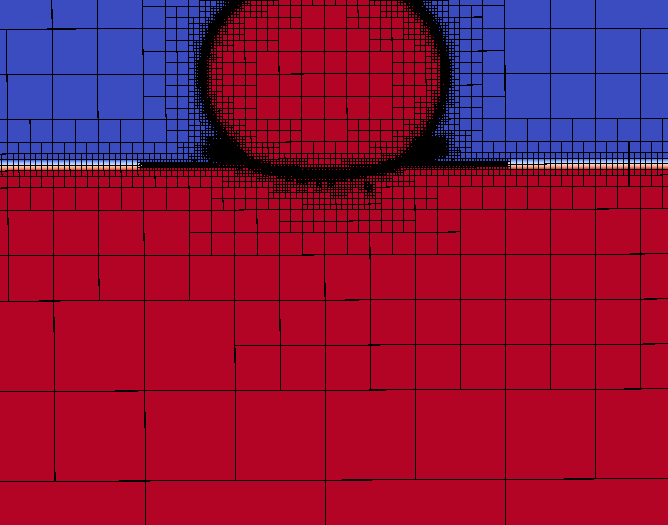
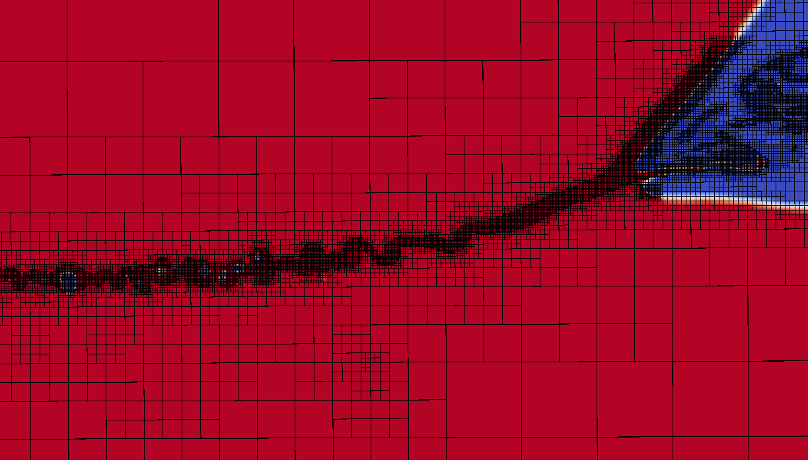

# No Oil
This Gerris Flow Simulation file is a part of a study on the impact of small droplet (radius ~= 4 mm) on free surface. 
This study is interrested in cases where there is an oil layer over the free surface
In this template the is no oil layer, as it is a control case for the general problem.
 

# Small domain 

In the experiment, the domain have the dimension of 15.2 cm² by 8cm of height , here we have a cube with 1.28 cm edge

# Max level 

a level corresponds to the power on with an initial box is divised by, here we have max level =11 which mean the most refined edge have the dimension of 6.4 mm  * 2⁻¹¹ = 3.125 µm

